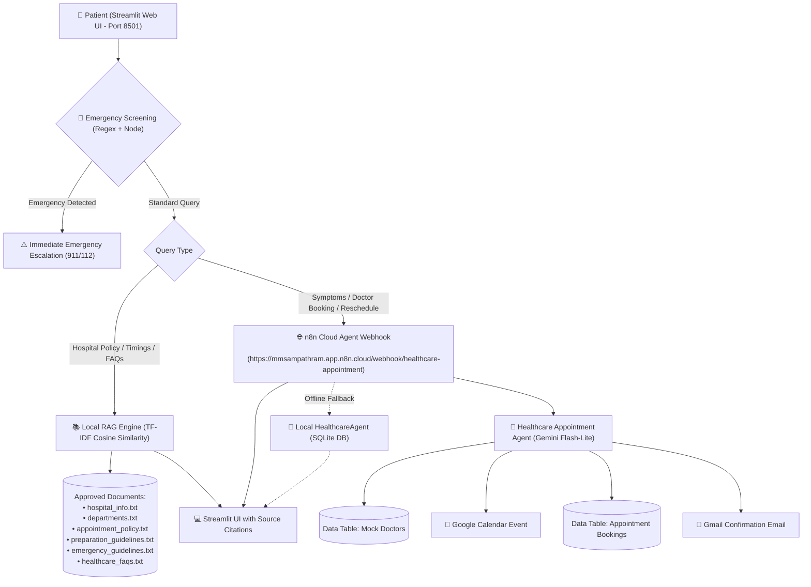

# 🏥 CityCare Healthcare AI Appointment Assistant

An enterprise-grade, agentic healthcare appointment assistant and clinic receptionist that combines a **live n8n Workflow Backend**, a **Local RAG (Retrieval-Augmented Generation) Knowledge Base**, and a modern **Streamlit Web Interface**.

Patients can describe symptoms in natural language, undergo automatic emergency screening, get routed to appropriate departments and doctors, schedule real Google Calendar appointments with Gmail confirmation receipts, and query verified hospital policy/preparation documents.

---

## 🏗️ System Architecture



---

## ✨ Features

- 🤖 **Agentic AI Workflow** — n8n orchestrates tool calling, decision-making, and calendar/email fulfillment.
- 💬 **Natural Language Chat** — Streamlit-based conversational interface with live agent feedback.
- 🧠 **RAG Knowledge Base** — Answers grounded in 6 approved hospital documents with strict anti-hallucination guardrails.
- 📅 **Real Appointment Booking** — Schedules real Google Calendar events and sends Gmail confirmation receipts with booking IDs.
- 🏥 **Department & Doctor Triage** — Symptom-based department identification and doctor selection.
- 👤 **Sidebar Patient Profile** — Defaults to **Sampath** (`sampathram777@gmail.com`). Name and email are automatically passed to every chat turn.
- 📆 **Dynamic Date Prompting** — If no date is given in the chat, the assistant automatically asks the patient for their preferred date.
- 🔎 **Real-time Activity Display** — Live agent step-by-step activity log and RAG source attribution badges (`📄 preparation_guidelines.txt`).
- 🚨 **Two-Layer Emergency Detection** — Immediate safety override for critical symptoms (`severe chest pain`, `cannot breathe`, `stroke`).
- 💾 **Dual Persistence** — n8n Data Tables (`Appointment Bookings`) + Local SQLite fallback database.

---

## 📁 Project Structure

```
health-agent/
├── app.py                      # Main Streamlit Web Application (UI + Dual-Mode Routing)
├── .env                        # Environment configuration (Webhook URLs, API keys)
├── .env.example                # Environment variables template
├── requirements.txt            # Python dependencies
│
├── rag/                        # Local RAG Knowledge Base
│   └── documents/              # Approved hospital policy and guideline documents
│       ├── hospital_info.txt
│       ├── departments.txt
│       ├── appointment_policy.txt
│       ├── preparation_guidelines.txt
│       ├── emergency_guidelines.txt
│       └── healthcare_faqs.txt
│
├── tools/                      # Agent Tools
│   ├── __init__.py
│   ├── rag_tool.py             # Local TF-IDF chunking & vector similarity search
│   ├── department_tool.py      # Symptom-to-department routing
│   ├── doctor_tool.py          # Doctor search tool
│   ├── availability_tool.py    # Appointment slot checker
│   └── appointment_tool.py     # SQLite appointment booking tool
│
├── agent/                      # Standalone Local Python Agent Fallback
│   ├── __init__.py
│   ├── agent.py                # Local agentic loop orchestration
│   ├── state.py                # Conversation state tracking
│   └── prompts.py              # Activity descriptions and prompts
│
├── database/                   # Local SQLite Fallback Database
│   ├── __init__.py
│   ├── database.py             # SQLAlchemy session manager
│   ├── models.py               # Database schemas (Department, Doctor, Appointment)
│   ├── seed.py                 # Initial data seeder (5 depts, 10 doctors, 7-day slots)
│   └── healthcare.db           # SQLite database file
│
├── n8n/                        # n8n Workflow JSON Exports
│   ├── Healthcare AI Appointment Assistant - Single Workflow.json
│   └── RAG Document Ingestion Workflow.json
│
└── utils/                      # Helper Utilities
    ├── __init__.py
    └── helpers.py              # Emergency detection regex & response formatters
```

---

## 🔧 Agent Tools

### RAG Tool
- **`search_knowledge_base(query)`** — Searches approved healthcare documents via chunking and TF-IDF similarity search with source attribution.

### Appointment Tools
- **`screen_for_emergency`** — Pre-screening safety check before any booking action.
- **`find_department(symptoms)`** — Routes symptoms to the appropriate department.
- **`find_doctors(department)`** — Reads available doctors from the `Mock Doctors` table.
- **`check_availability(doctorName)`** — Returns available consultation slots.
- **`create_calendar_event`** — Real Google Calendar event creation on `sampathram@student.tce.edu`.
- **`save_booking`** — Inserts confirmed booking into `Appointment Bookings` table.
- **`send_confirmation_email`** — Sends real Gmail confirmation email to patient.
- **`cancel_calendar_event`** — Deletes the calendar event upon cancellation.
- **`reschedule_calendar_event`** — Updates the calendar event to a new date and time.
- **`update_booking_status`** — Updates the booking row status in the Data Table.

---

## 🧪 Test Cases

| # | Query | Expected Behavior |
|---|-------|------------------|
| 1 | *"What should I bring to my appointment?"* | Uses Local RAG (`preparation_guidelines.txt`) |
| 2 | *"What are the hospital operating timings?"* | Uses Local RAG (`hospital_info.txt`) |
| 3 | *"What is the cancellation policy?"* | Uses Local RAG (`appointment_policy.txt`) |
| 4 | *"Does the hospital accept health insurance?"* | Uses Local RAG (`healthcare_faqs.txt`) |
| 5 | *"I have a fever and headache and want to see a doctor."* | Uses n8n Agent (routes to General Medicine and prompts for date) |
| 6 | *"Tomorrow at 10:00 AM with Dr. Ananya"* | Uses n8n Agent (confirms booking, creates calendar event, sends email) |
| 7 | *"I have severe chest pain."* | Triggers Emergency Alert immediately (911/112 guidance) |

---

## 🚀 Getting Started

### 1. Prerequisites
- Python 3.10 or higher
- Git

### 2. Installation
```powershell
# Clone the repository
git clone https://github.com/dharshinir11/health-agent.git
cd health-agent

# Create and activate virtual environment
python -m venv venv
.\venv\Scripts\activate   # On Windows
# source venv/bin/activate  # On macOS/Linux

# Install dependencies
pip install -r requirements.txt
```

### 3. Configure Environment Variables
Copy `.env.example` to `.env`:
```env
# n8n Cloud Webhook URL
N8N_WEBHOOK_URL=https://mmsampathram.app.n8n.cloud/webhook/healthcare-appointment

# Local SQLite Database URL (Fallback)
DATABASE_URL=sqlite:///database/healthcare.db

# Application Configuration
APP_ENV=development
APP_PORT=8501
DEBUG=True
```

### 4. Initialize Local Database (Optional Fallback)
```powershell
python -m database.seed
```

### 5. Launch the Application
```powershell
streamlit run app.py --server.port 8501
```
Open your browser and navigate to **`http://localhost:8501`**.

---

## 🛡️ Healthcare Safety Limitations

- **No Medical Diagnosis** — The agent never diagnoses conditions or prescribes medicines.
- **No Fabricated Information** — RAG only returns content from approved documents.
- **Emergency First** — Emergency keywords override all other flows.
- **Confirmation Before Booking** — Appointments require explicit user confirmation.
- **Source Attribution** — RAG responses cite the source document.
- **Educational Use Only** — Not for real medical decisions.

---

## 📄 License & Disclaimer

This project is created for academic and demonstration purposes. It is a mock system and must not be used for actual medical emergencies or real clinical diagnoses.
